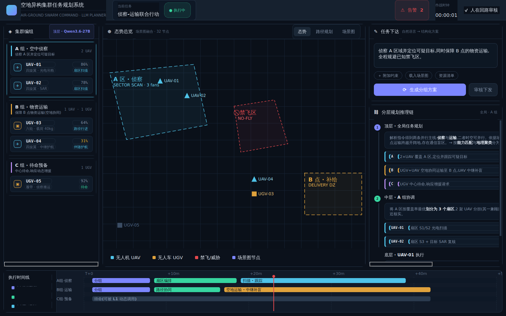

# swan-planner · 空地异构集群任务规划系统

基于大模型的**空地异构集群(无人机 + 无人车)分层任务规划系统**指挥控制台。
采用「大模型做慢思考、经典算法做快反应」的三层规划架构,用 **PySide6(Qt)** 实现。



## 分层架构

| 层级 | 职责 | 所用模型 | 输出 |
|------|------|---------|------|
| **L1 顶层** | 全局任务分解、集群编组、组任务分配 | `Qwen3.6-27B` | 分组—任务方案 |
| **L2 中层** | 组内任务细化、平台角色分配、局部重规划 | `Qwen3.6-27B` | 各平台行为序列 |
| **L3 底层** | 语义指令→技能原语、视觉理解、执行监控 | `Qwen2.5-7B + VL-7B` | 技能原语调用 |

设计要点:大模型只做规划、**不进控制环**;运动/避障由经典控制栈执行;
场景图作为大模型与物理世界之间的结构化接口;层间以统一 Schema 传递任务。

> 详细设计思路见 [`docs/design.md`](docs/design.md)。

## 界面构成

- **头部栏** —— 任务状态、作战时钟、告警、人在回路审核开关
- **左栏 · 集群编组** —— L1 输出的分组结果,空(青)/地(琥珀)双色编码
- **中央 · 态势总览** —— 区域 / 平台 / 路径 / 场景图,可在「态势 / 路径规划 / 场景图」间切换
- **右栏 · 任务下达 + 分层推理链** —— 自然语言下达,展示 L1→L2→L3 完整推理链
- **底部 · 执行时间线** —— 三层活动的甘特图

## 运行

```bash
pip install -r requirements.txt
python main.py
```

> 需要图形界面环境。当前大模型 I/O 由 `swan_planner/models/mock_llm.py` 以**预测实例**模拟,
> 接口与真实推理服务保持一致,后续可无缝替换。

## 工程结构

```
swan-planner/
├── main.py                     # 入口
├── requirements.txt
└── swan_planner/
    ├── app.py                  # 主窗口装配与信号接线
    ├── config.py               # 配色 / 模型命名 / 层级定义
    ├── theme.py                # 全局 QSS 主题
    ├── models/
    │   ├── data.py             # 领域对象与种子场景
    │   └── mock_llm.py         # Mock Qwen 规划器(预测实例)
    └── widgets/
        ├── header_bar.py       # 头部栏
        ├── group_tree.py       # 集群编组
        ├── situation_map.py    # 态势地图(QGraphicsView)
        ├── task_panel.py       # 任务下达
        ├── reasoning_chain.py  # 分层推理链
        └── timeline.py         # 执行时间线
```

## 开发路线

- [x] **v0.1 界面** —— 完整指挥控制台界面 + mock 规划器 + 分组/视图联动
- [ ] **v0.2 规划** —— 层间统一任务 Schema 校验、可行性检查、失败降级
- [ ] **v0.3 闭环** —— 事件驱动的动态重规划(成员失效 / 发现新目标逐级上报)
- [ ] **v0.4 接入** —— 用真实 Qwen 推理服务替换 mock,流式渲染推理链
- [ ] **v0.5 场景图** —— 多机场景图融合与实时更新
- [ ] **v0.6 通信** —— 平台遥测接入、中心—组—平台分层通信与断链降级

## 许可证

MIT
