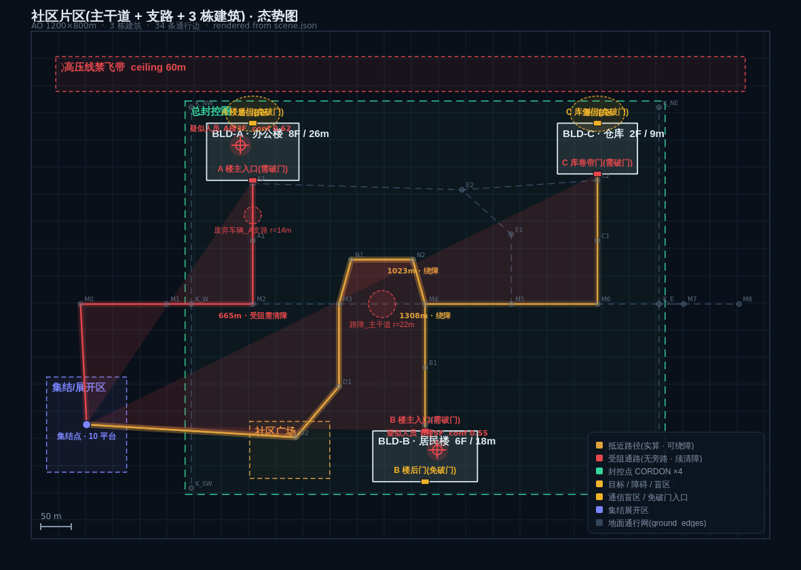

# swan-planner · 空地异构集群任务规划系统

基于大模型的**空地异构集群(无人机 + 无人车)分层任务规划系统**指挥控制台。
采用「大模型做慢思考、经典算法做快反应」的三层规划架构,用 **PySide6(Qt)** 实现。




默认场景为**社区片区**:一条主干道 + 多条支路、**3 栋建筑**,集群 **100 台 = 10 种类型 × 10**。

## 分层架构

| 层级 | 职责 | 所用模型 | 输出 |
|------|------|---------|------|
| **L1 顶层** | 全局任务分解、集群编组、组任务分配 | `Qwen3.6-27B` | 分组—任务方案 |
| **L2 中层** | 组内任务细化、平台角色分配、局部重规划 | `Qwen3.6-27B` | 各平台行为序列 |
| **L3 底层** | 语义指令→技能原语、视觉理解、执行监控 | `Qwen2.5-7B + VL-7B` | 技能原语调用 |

设计要点:大模型只做规划、**不进控制环**;运动/避障由经典控制栈执行;
场景以结构化 JSON 描述作为大模型与物理世界之间的接口;层间以统一 Schema 传递任务。

> 详细设计思路见 [`docs/design.md`](docs/design.md)。

## 规划管线(后端)

规划器以 **JSON 场景描述** 与 **平台能力档案** 为输入,通过能力匹配完成任务分配:

1. **场景驱动任务规格** —— 每栋建筑编成一个**任务群**,另设总封控圈任务群。
   角色需求由场景实算:封控点数按周长、室内分队按楼层、破障分队按
   「需破门入口数 + 无旁路的受阻通路数」。改场景即改编成,无需改代码。
2. **供给感知的需求下调** —— 先按「稀缺能力优先预留」算**有效供给**
   (UGV-I 同时具 `indoor_nav` 与 `ground_recon`,被室内清查预留后不再计入封控供给),
   需求超出即按优先级加权下调密度,而不是一边报缺编、一边让干不了这活的预备队闲置。
3. **两阶段全局最优指派** —— 阶段一为每个角色先保 1 个槽位,保障各任务群的
   **最小可行编成**(避免 P2 任务群被 P1 抢空而饿死);阶段二在余量平台中按优先级
   加权求全局最优。用**匈牙利算法**(scipy)最大化总效用;scipy 缺失时回退贪心。
4. **专才保护** —— 打分对「本角色用不到、但别处正紧缺」的能力施加惩罚,
   避免稀缺专才(如室内履带)被派去干通用活(如楼周封控)。
5. **分队细化**(L2)—— 由建筑高度推导扫描高度、Dijkstra 求抵近路径并区分
   「可绕行」与「无旁路须清障」。
6. **技能编译**(L3)—— 译为带参数的技能原语。

**执行逻辑**:L1(全局规划 + 指派)在后台线程只跑一次;选组仅做 L2/L3 的惰性组装
(纯查询,毫秒级)。100 台 / 56 槽位规模下 L1 约 **6ms**,主窗口构建 174ms。

**编成规模**:界面按**分队聚合**展示(不逐台罗列),地图对平台标记**聚簇**。

## 工程结构

```
swan-planner/
├── main.py                     # 入口
├── requirements.txt
├── tools/
│   ├── gen_large_scenario.py   # 生成大场景 + 100 台集群 JSON
│   └── render_scene_map.py     # 从 scene.json 渲染态势图
└── swan_planner/
    ├── app.py                  # 主窗口装配与信号接线(L1 一次 / L2-L3 按组)
    ├── config.py               # 配色 / 模型命名 / 层级定义
    ├── theme.py                # 全局 QSS 主题
    ├── data/
    │   ├── scene.json          # 小场景(侦察-运输)
    │   ├── platforms.json      # 小场景平台档案
    │   └── scenarios/
    │       ├── large_scene.json      # 默认:主干道+支路+3栋建筑
    │       ├── large_platforms.json  # 默认:100 台 = 10 类型 × 10
    │       ├── community_scene.json  # 单建筑场景
    │       └── community_platforms.json
    ├── models/
    │   ├── scene.py            # 场景解析 · 几何查询 · 路径搜索 · 受阻检测
    │   ├── data.py             # 领域对象与 JSON 加载器
    │   └── planner.py          # 规划引擎:两阶段最优指派 + 任务群/分队编成
    └── widgets/
        ├── header_bar.py       # 头部栏
        ├── group_tree.py       # 集群编组
        ├── situation_map.py    # 态势地图(QGraphicsView)
        ├── task_panel.py       # 任务下达
        ├── reasoning_chain.py  # 分层推理链
        └── timeline.py         # 执行时间线
```

## 开发路线

- [x] **v0.1 界面** —— 完整指挥控制台界面 + mock 规划器 + 分组/视图联动
- [x] **v0.2 规划** —— JSON 场景 + 平台能力 → 能力匹配任务分配;L1/L2/L3 分离执行;
      扇区分解、障碍规避路径搜索、高度推导
- [x] **v0.3 规模化** —— 主干道+支路+3 栋建筑场景;100 台集群;两阶段匈牙利最优指派、
      供给感知需求下调、专才保护;界面分队聚合与地图聚簇
- [ ] **v0.3.1** —— 层间任务 Schema 的显式校验、可行性检查与失败降级
- [ ] **v0.3 闭环** —— 事件驱动的动态重规划(成员失效 / 发现新目标逐级上报)
- [ ] **v0.4 接入** —— 用真实 Qwen 推理服务替换 mock,流式渲染推理链
- [ ] **v0.5 场景图** —— 多机场景图融合与实时更新
- [ ] **v0.6 通信** —— 平台遥测接入、中心—组—平台分层通信与断链降级

## 许可证

MIT
