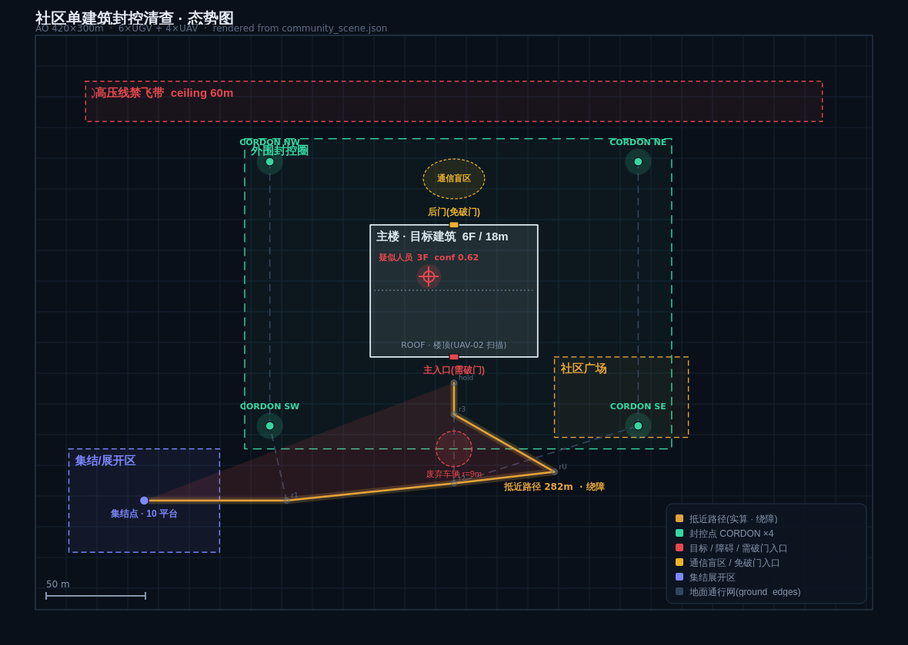

# 规划结果示例 · 社区单建筑封控清查



> 地图由 [`tools/render_scene_map.py`](../tools/render_scene_map.py) 从
> `community_scene.json` 直接渲染,抵近路径为 `scene.py` 的 Dijkstra 实算结果 ——
> 地图与规划结果同源,不会各画各的。重新生成:
> ```bash
> python tools/render_scene_map.py swan_planner/data/scenarios/community_scene.json docs/community_map.png
> ```

**输入**
- 场景:[`community_scene.json`](../swan_planner/data/scenarios/community_scene.json) —— 社区 420×300m,主楼 6 层 / 18m,北侧高压线禁飞带(天花板 60m),废弃车辆阻断主入口正面通路,楼体背面通信盲区。
- 装备:[`community_platforms.json`](../swan_planner/data/scenarios/community_platforms.json) —— 6×UGV + 4×UAV。
- 指令:*"封控社区主楼,查明楼内人员情况,必要时开辟入口进入清查,做好伤员后送准备。"*

**L1 分组结果(能力匹配)**

| 组 | 任务 | 成员 | 关键匹配依据 |
|----|------|------|------------|
| **A · 空中侦察** | 广域监视 + 立面/楼顶侦察 | UAV-01、UAV-02 | `aerial_survey`;UAV-02 具 `thermal_imaging`+`facade_scan` |
| **B · 外围封控** | 四角封控、管控出入 | UGV-03、UGV-04 | `ground_recon` / `comm_relay`;就近 SW |
| **C · 突入清查** | 破障开门 + 室内清查 | UGV-02、UGV-05、UAV-04 | `breach` / `indoor_nav`(宽 0.5m)/ `indoor_flight`(宽 0.25m) |
| **D · 通信保障** | 空地双中继补盲 | UAV-03、UGV-04\* | `comm_relay`+`mesh_node` |
| **E · 保障后送** | 物资前送 / 伤员后送 | UGV-01、UGV-06 | `transport` / `casevac`(载荷 120kg) |

\* UGV-04 兼任封控点与地面 mesh 节点(静止中继)。

**关键参数(由场景实算)**

| 参数 | 值 | 推导依据 |
|------|-----|---------|
| 广域侦察高度 | **38m AGL** | 楼高 18m + 20m 余量,且 < 禁飞带 60m |
| 立面扫描高度 | **3→18m 逐层** | 6 层 × 3m 层高 |
| 抵近路径 | `stage→r1→r2→rU→r3→hold`,**282m** | Dijkstra **绕行**规避废弃车辆(正面直行被阻) |
| 封控点路径 | SW 111m / SE 253m / NW 249m / NE 391m | 地面子图最短路 |
| 通信补盲 | 楼体背面 | UAV-03 悬停 + UGV-04 地面 mesh 双链路 |

---

## 分阶段规划

| 阶段 | 时间 | 目标 | 进入下一阶段的条件(Gate) |
|------|------|------|------------------------|
| **P0 展开** | T+0~5 | 集结区起飞/出发,建链 | 通信链路就绪、全平台自检通过 |
| **P1 封控 + 广域侦察** | T+5~15 | 四角封控成型,楼体外部态势建立 | **封控闭合**(ROE 前置条件) |
| **P2 精细侦察** | T+15~25 | 立面/楼顶逐层扫描,目标确认 | 目标 conf ≥ 0.85 且入口可达 |
| **P3 抵近开辟** | T+25~35 | 清障、抵近、破门 | **人工确认破门**(ROE) |
| **P4 内部清查** | T+35~50 | 空地协同室内清查至 3F | 目标处置完毕 / 楼内清空 |
| **P5 处置撤收** | T+50~60 | 后送、回收、撤离 | 全平台归建 |

---

## 各装备行动序列

### UAV-01 · EO 广域侦察(A 组)
```
P0  T+0    takeoff(alt=38m) → goto(z_cordon_center)
P1  T+5    orbit(z_building, r=60m, alt=38m)      # 广域监视,建立外部态势
    T+7    vl_detect(person|vehicle) → report(scene_json)
P2  T+15   track(tgt_01, handoff_from=UAV-02)     # 接手跟踪,释放 UAV-02 去扫立面
P3  T+25   overwatch(hold_point)                  # 为抵近提供上方掩护
P4  T+35   overwatch(e_main) + relay_video(C组)
P5  T+52   rtb(stage) → land()
```

### UAV-02 · 热成像 / 立面扫描(A 组)
```
P0  T+0    takeoff(alt=38m)
P1  T+6    thermal_sweep(z_building, alt=38m)     # 热成像初筛,发现 3F 热源
    T+9    report(tgt_01, conf=0.62)
P2  T+15   facade_scan(face=S, alt=3→18m, step=3m)   # 逐层扫描南立面
    T+19   facade_scan(face=N, alt=3→18m)             # 背面(依赖 UAV-03 中继)
    T+22   vl_confirm(tgt_01) → conf=0.88 ✓          # 达阈值 → 上报 L1
    T+24   scan(roof) → report(无楼顶人员)
P3  T+25   handoff(tgt_01 → UAV-01) → loiter(z_plaza)
P4  T+38   thermal_monitor(z_building)            # 持续热成像监视楼内移动
P5  T+50   rtb(stage) → land()
```

### UAV-03 · 空中中继(D 组)
```
P0  T+0    takeoff(alt=50m) → goto(blind_01_above)
P1  T+4    hover(alt=50m, over=blind_01)          # 楼体背面上方,禁飞带 60m 以下
    T+5    mesh_link(UGV-04, ground_station)      # 与地面中继车组双链路
P2  T+15   maintain_relay()                       # 保障 UAV-02 背面扫描回传
P4  T+35   relay_boost(C组室内链路)                # 室内信号弱,提升增益
P5  T+55   rtb(stage) → land()
```

### UAV-04 · 微型穿越机 / 室内(C 组)
```
P0  T+0    standby(low_power)                     # 续航仅 9min,推迟到 P4 才起飞
P3  T+33   preflight_check() → 等待破门
P4  T+35   takeoff() → enter(e_main)              # 破门后首个进入(风险最低)
    T+36   indoor_sweep(1F) → report()
    T+38   climb_stairwell() → indoor_sweep(2F)
    T+40   indoor_sweep(3F) → vl_confirm(tgt_01)  # 确认人员位置/状态
    T+42   mark_position(tgt_01) → 引导 UGV-05
    T+43   rtb(e_main) → land()                   # 电量告警,退出
P5  —      recovered_by(UGV-01)
```

### UGV-01 · 通用运输(E 组)
```
P0  T+0    load(器材+备用电池)
P1  T+6    follow(stage→r1→r2, 停 r2)             # 前出至后方待机
P3  T+30   deliver(破障器材 → UGV-02 @ r3)
P4  T+43   recover(UAV-04 @ e_main)               # 回收电量耗尽的穿越机
P5  T+52   load(全部器材) → follow(→stage)
```

### UGV-02 · 破障开门(C 组)
```
P0  T+0    self_check(manipulator)
P1  T+8    follow(stage→r1→r2, 停 r2)             # 封控未闭合前不得抵近(ROE)
P3  T+25   follow(r2→rU→r3)                       # 绕行规避废弃车辆
    T+28   clear_obstacle(veh_blk)                # 清除,为后续开辟直行通路
    T+31   goto(hold) → approach(e_main)
    T+33   breach_request(e_main) → ⏸ 人工确认     # ROE:破门需指挥员确认
    T+34   breach(e_main)                         # 确认后执行
P4  T+35   hold(e_main) → secure_entry()          # 守住入口,不入楼
P5  T+52   follow(→stage)
```

### UGV-03 · 外围侦察(B 组)
```
P0  T+0    follow(stage→r1)
P1  T+3    follow(r1→c_sw) [111m] → cordon_hold(SW)
    T+6    follow(c_sw→c_nw) [+138m] → cordon_hold(NW)   # 机动封控两点
    T+9    patrol(SW↔NW), vl_detect(出入人员)
P2  T+15   ground_recon(楼体西侧) → report(scene_json)
P4  T+35   cordon_hold(NW) → monitor(e_back)      # 盯住后门,防外逃
P5  T+55   follow(→stage)
```

### UGV-04 · 通信中继车(B/D 组)
```
P0  T+0    follow(stage→r1→r2→c_se) [253m]
P1  T+7    cordon_hold(SE) → deploy_mast()        # 展开天线杆
    T+9    mesh_node(link=[UAV-03, ground_station]) # 地面 mesh 节点
P2  T+15   maintain_link()                        # 与 UAV-03 构成双链路冗余
P4  T+35   relay(C组室内 ↔ 指挥所)                 # 室内链路的地面锚点
P5  T+56   stow_mast() → follow(→stage)
```

### UGV-05 · 小型室内侦察(C 组)
```
P0  T+0    self_check(stair_climb)
P1  T+10   follow(stage→r1→r2, 停 r2)
P3  T+30   follow(r2→rU→r3→hold)                  # 破门前抵达待机位
P4  T+36   enter(e_main)                          # 穿越机先探,UGV-05 随后
    T+38   indoor_nav(1F) → ground_recon(1F)
    T+41   stair_climb(1F→2F) → indoor_nav(2F)
    T+44   stair_climb(2F→3F) → goto(tgt_01_marked) # 依 UAV-04 标记直达
    T+46   ground_recon(3F) → vl_confirm(tgt_01)
    T+48   report(人员状态) → ⏸ 等待处置指令
P5  T+52   exit(e_main) → follow(→stage)
```

### UGV-06 · 医疗后送(E 组)
```
P0  T+0    standby(stage)                         # 保障力量,不前出
P3  T+32   follow(stage→r1→r2) → standby(r2)      # 破门前进入待命位
P4  T+48   [触发] casevac_dispatch(tgt_01)        # 收到人员需后送指令
    T+50   follow(r2→rU→r3→hold) → load(伤员)
P5  T+55   follow(→stage) → handover(医疗点)
```

---

## 阶段协同要点

**P1 → P2 的门禁**:ROE 要求「内部清查前须完成外围封控」。因此 UGV-02/05 虽在 P1 即出发,但只前出到 r2 待机,**不得抵近**,直到四角封控闭合(T+9)。

**空地互补**:UAV-02 热成像在 T+9 就发现 3F 热源(conf 0.62),但**不足以支撑破门决策**;经 P2 立面逐层扫描后升至 0.88 越过阈值,才触发 P3。地面平台全程不承担远距识别。

**通信盲区处置**:楼体背面是盲区,UAV-02 扫背面立面(T+19)时依赖 UAV-03 空中中继 + UGV-04 地面 mesh 的**双链路冗余**——单链路失效不中断侦察。

**续航驱动的时序**:UAV-04 续航仅 9min,L1 因此**故意不让它在 P0 起飞**,压到 T+35 破门后才升空,把电量全用在室内。T+43 电量告警退出,由 UGV-01 回收。

**风险递进**:进楼顺序是 UAV-04(微型、可弃)→ UGV-05(小型履带)→ 人员始终不入。UGV-02 破门后**只守入口不入楼**,保持退路。

**人在回路点**:T+33 破门前须指挥员确认(ROE 硬约束);T+48 人员处置须确认。这两处 L3 会挂起等待,不会自行推进。

## 重规划触发示例

| 事件 | 消化层级 | 处置 |
|------|---------|------|
| UAV-02 电量 < 20% | **L2**(A 组内) | 立面扫描剩余面移交 UAV-01,不惊动 L1 |
| 废弃车辆无法清除 | **L2**(C 组内) | 改由后门 `e_back` 突入(`breach_req=false`,无需破门) |
| 3F 发现多名人员 | **L1** | 调 E 组 UGV-06 前移,并申请增援 |
| UGV-04 中继车失效 | **L1** | 通信链路降级 → 暂停 P4 室内清查,UAV-03 单链路不足以支撑 |
